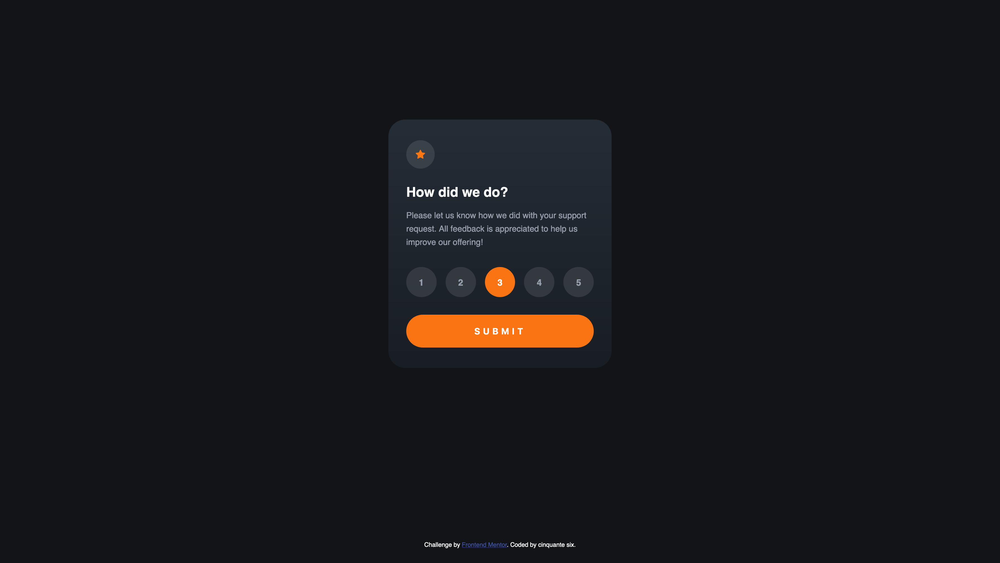

# Frontend Mentor - Interactive rating component solution

This is a solution to the [Interactive rating component challenge on Frontend Mentor](https://www.frontendmentor.io/challenges/interactive-rating-component-koxpeBUmI). Frontend Mentor challenges help you improve your coding skills by building realistic projects. 

## Table of contents

- [Overview](#overview)
  - [The challenge](#the-challenge)
  - [Screenshot](#screenshot)
  - [Links](#links)
- [My process](#my-process)
  - [Built with](#built-with)
  - [What I learned](#what-i-learned)
  - [Continued development](#continued-development)
  - [Useful resources](#useful-resources)
- [Author](#author)
- [Acknowledgments](#acknowledgments)

## Overview

### The challenge

Users should be able to:

- View the optimal layout for the app depending on their device's screen size
- See hover states for all interactive elements on the page
- Select and submit a number rating
- See the "Thank you" card state after submitting a rating

### Screenshot

### Links

- Solution URL: [Add solution URL here](https://your-solution-url.com)
- Live Site URL: [https://gleaming-meerkat-dc5f9a.netlify.app/](https://gleaming-meerkat-dc5f9a.netlify.app/)

## My process
### Built with

- Semantic HTML5 markup
- CSS Grid
- Vanilla JS

### What I learned

It was my first project with github, so I learn a lot about HTML/CSS/JS but also with VScode and github. What I tried during the process:

- Learn more about Grid and placement
- Try to forget a bit about jQueries to learn more about vanilla JS

### Continued development

I think sometimes, I don't take the "easy way" to solve the situation… I, maybe, rebuild three or four time my CSS to be sure that it will work in any case. So I need to learn more about a better way to approach. 

For the JS, I understand what the code make, but I need to be able to start this kind of code from scratch (like I do in jQueries).

### Useful resources

- [CSS Grid Guide](https://css-tricks.com/snippets/css/complete-guide-grid/) - The perfect guide for every case 
- [YT - Kevin Powel](https://www.youtube.com/kevinpowell) - Learn a lot how to handle a problem in different point of view

## Author

- Frontend Mentor - [@Cinquantesix](https://www.frontendmentor.io/profile/Cinquantesix)
- Instagram - [@cinquante_six](https://www.instagram.com/cinquante_six/)

## Acknowledgments

Big thanks to [@gmagnenat ](https://github.com/gmagnenat) for his help and patience!
